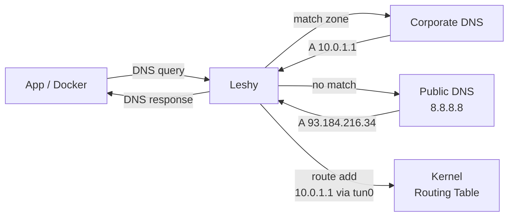
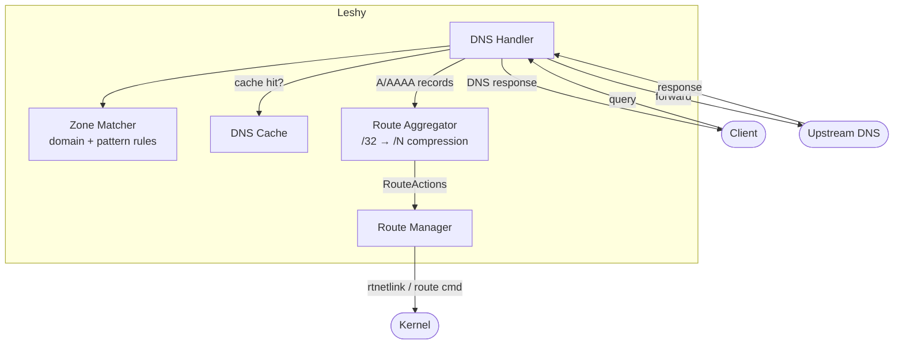

# Leshy

DNS-driven split-tunnel router. Resolves domains, installs kernel routes -- only the traffic that needs a VPN goes through a VPN. Zero manual IP management, no over-routing, no leaks. Rust, Linux + macOS.



## Quick Start

```bash
# Build
cargo build --release
sudo cp target/release/leshy /usr/local/bin/

# Run (needs CAP_NET_ADMIN for routes, CAP_NET_BIND_SERVICE for port 53)
sudo leshy /etc/leshy/config.toml

# Or grant capabilities once and run without sudo
sudo setcap cap_net_admin,cap_net_bind_service+eip /usr/local/bin/leshy
leshy /etc/leshy/config.toml
```

Point your system DNS at Leshy:

```
# /etc/resolv.conf
nameserver 127.0.0.53
```

## Configuration

```toml
[server]
listen_address = "127.0.0.53:53"
default_upstream = ["8.8.8.8:53", "8.8.4.4:53"]

[[zones]]
name = "corporate"
dns_servers = ["10.0.0.2:53"]
route_type = "dev"                       # route via VPN tunnel device
route_target = "/run/vpn/corporate.dev"  # file containing device name (e.g. "tun0")
domains = ["internal.company.com", "git.company.com"]
patterns = ["corp"]                      # substring match

[[zones]]
name = "eu"
route_type = "via"              # route via static gateway
route_target = "192.168.169.1"
domains = ["example.com"]
```

See [config.example.toml](config.example.toml) for all options.

### Route Types

| Type | Target | Use case |
|------|--------|----------|
| `dev` | Path to file containing device name | VPNs that connect/disconnect (tun0, wg0) |
| `via` | Gateway IP address | Always-on VPN or static gateway |

### Domain Matching

- **`domains`** -- exact match + all subdomains (`company.com` matches `git.company.com`)
- **`patterns`** -- substring match anywhere in the queried name

## Why Leshy

Traditional split-tunnel tools like `vpn-slice` hardcode IPs in `/etc/hosts`, which breaks isolated networking (Docker builds, sandboxes). Leshy runs as a DNS server -- all apps get correct routing transparently.

## Features

- **Zone-based routing** -- different DNS servers and route targets per zone
- **Hot reload** -- `auto_reload = true` watches config and applies changes live
- **Composable config** -- split zones into `config.d/*.toml` files
- **DNS caching** -- with per-zone and per-server TTL overrides
- **Route aggregation** -- compress /32 host routes into wider CIDR prefixes (`route_aggregation_prefix = 24`)
- **Static routes** -- add CIDR routes on startup (`static_routes = ["10.0.0.0/8"]`)
- **Upstream failover** -- tries DNS servers in order, falls over on failure
- **VPN reconnect** -- device file disappears/reappears as VPN disconnects/connects
- **Linux + macOS** -- rtnetlink on Linux, `/sbin/route` on macOS

## systemd

```ini
[Unit]
Description=Leshy split-tunnel DNS server
After=network.target

[Service]
Type=simple
ExecStart=/usr/local/bin/leshy /etc/leshy/config.toml
Restart=on-failure
CapabilityBoundingSet=CAP_NET_BIND_SERVICE CAP_NET_ADMIN
AmbientCapabilities=CAP_NET_BIND_SERVICE CAP_NET_ADMIN

[Install]
WantedBy=multi-user.target
```

## VPN Integration

Write the tunnel device name when VPN connects:

```bash
echo "$TUNDEV" > /run/vpn/corporate.dev
```

Leshy reads this file on each DNS query. When the file disappears (VPN disconnects), route addition fails gracefully and DNS responses are still returned.

---

## Internals

### Architecture



### Project Structure

```
src/
  config.rs             Config parsing (TOML, zones, dns_servers)
  dns/
    handler.rs          DNS request handler, upstream forwarding
    cache.rs            DNS response cache
  routing/
    mod.rs              Route manager (add/remove routes per zone)
    aggregator.rs       CIDR route aggregation (/32 → wider prefixes)
    linux.rs            Linux rtnetlink operations
    macos.rs            macOS /sbin/route operations
  reload.rs             Hot-reload config watcher
  zones/
    matcher.rs          Domain/pattern matching for zones
```

### Route Aggregation

When `route_aggregation_prefix` is set (e.g. `24`), instead of adding a /32 for each resolved IP, Leshy installs a wider prefix covering that IP. Future IPs in the same range and zone are no-ops. If an IP from a different zone falls into an existing aggregate, it splits into non-conflicting sub-prefixes.

### Development

```bash
make test              # fmt + clippy + unit tests
make integration-test  # Docker e2e (12 tests)
make watch             # auto-test on changes
```

## License

MIT
