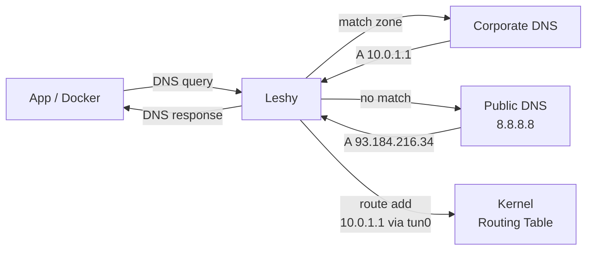
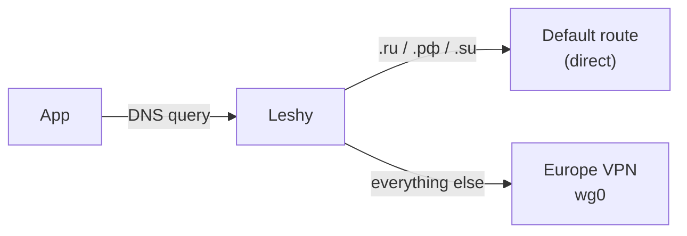

# Leshy

DNS-driven split-tunnel router. Resolves domains, installs kernel routes -- only the traffic that needs a VPN goes through a VPN. Zero manual IP management, no over-routing, no leaks. Rust, Linux + macOS.



## Quickstart

```bash
# Install
cargo install leshy

# Write your config
sudo mkdir -p /etc/leshy
sudo vim /etc/leshy/config.toml   # see Configuration below

# Install and start as a system service (systemd / launchd)
sudo leshy service install

# Point your DNS at Leshy
echo "nameserver 127.0.0.53" | sudo tee /etc/resolv.conf
```

That's it. Leshy is running, will start on boot, and routes VPN traffic automatically.

## Configuration

```toml
[server]
listen_address = "127.0.0.53:53"
default_upstream = ["8.8.8.8:53", "8.8.4.4:53"]

[[zones]]
name = "corporate"
dns_servers = ["10.0.0.2:53"]
route_type = "dev"                       # route via VPN tunnel device
route_target = "/run/vpn/corporate.dev"  # file containing device name (e.g. "tun0")
domains = ["internal.company.com", "git.company.com"]
patterns = ["corp"]                      # regex

[[zones]]
name = "eu"
route_type = "via"              # route via static gateway
route_target = "192.168.169.1"
domains = ["example.com"]
```

See [config.example.toml](config.example.toml) for all options.

### Route Types

| Type | Target | Use case |
|------|--------|----------|
| `dev` | Path to file containing device name | VPNs that connect/disconnect (tun0, wg0) |
| `via` | Gateway IP address | Always-on VPN or static gateway |

### Domain Matching

- **`domains`** -- exact match + all subdomains (`company.com` matches `git.company.com`)
- **`patterns`** -- regex match against the queried name

## Why Leshy

Traditional split-tunnel tools like `vpn-slice` hardcode IPs in `/etc/hosts`, which breaks isolated networking (Docker builds, sandboxes). Leshy runs as a DNS server -- all apps get correct routing transparently.

## Example: Route Everything Except .ru Through a European VPN

A common setup: you have a WireGuard/OpenVPN tunnel to a European server and want **all** traffic to go through it -- except Russian domains (.ru, .рф, .su) which should go direct.



```toml
[server]
listen_address = "127.0.0.53:53"
default_upstream = ["8.8.8.8:53", "1.1.1.1:53"]

[[zones]]
name = "eu-vpn"
mode = "exclusive"              # route everything EXCEPT matched domains
dns_servers = []                # use default upstream
route_type = "dev"
route_target = "/run/vpn/eu.dev"
# These domains are EXCLUDED from the VPN (go direct):
domains = []
patterns = [
    '\.ru$',                    # *.ru
    '\.xn--p1ai$',             # *.рф (punycode)
    '\.su$',                    # *.su
]
```

Write the device file when your VPN connects (`echo wg0 > /run/vpn/eu.dev`) and every domain that isn't .ru/.рф/.su gets routed through `wg0`. Local and Russian traffic stays on your normal connection.

## Features

- **Zone-based routing** -- different DNS servers and route targets per zone
- **Hot reload** -- `auto_reload = true` watches config and applies changes live
- **Composable config** -- split zones into `config.d/*.toml` files
- **DNS caching** -- with per-zone and per-server TTL overrides
- **Route aggregation** -- compress /32 host routes into wider CIDR prefixes (`route_aggregation_prefix = 24`)
- **Static routes** -- add CIDR routes on startup (`static_routes = ["10.0.0.0/8"]`)
- **Upstream failover** -- tries DNS servers in order, falls over on failure
- **VPN reconnect** -- device file disappears/reappears as VPN disconnects/connects
- **Linux + macOS** -- rtnetlink on Linux, `/sbin/route` on macOS

## Running as a Service

```bash
# Install with defaults (config: /etc/leshy/config.toml, service name: leshy)
sudo leshy service install

# Custom config path
sudo leshy service install --config /etc/leshy/corp.toml

# Multiple instances with different names
sudo leshy service install --name leshy-corp --config /etc/leshy/corp.toml
sudo leshy service install --name leshy-eu   --config /etc/leshy/eu.toml

# Remove a service
sudo leshy service uninstall
sudo leshy service uninstall --name leshy-corp
```

On Linux this creates a systemd unit with `CAP_NET_ADMIN` + `CAP_NET_BIND_SERVICE`. On macOS it creates a launchd plist with `KeepAlive` + `RunAtLoad`.

You can also run leshy directly:

```bash
sudo leshy /etc/leshy/config.toml
```

## VPN Integration

Write the tunnel device name when VPN connects:

```bash
echo "$TUNDEV" > /run/vpn/corporate.dev
```

Leshy reads this file on each DNS query. When the file disappears (VPN disconnects), route addition fails gracefully and DNS responses are still returned.

### Guides

- **[OpenConnect (Cisco AnyConnect) Split Tunnel](docs/openconnect-split-tunnel.md)** -- connect to a Cisco VPN without it taking over your default route; Leshy routes only corporate traffic through the tunnel
- **[SSH Tunnel + tun2socks](docs/ssh-tun2socks.md)** -- turn an SSH connection into a routable tunnel device; route selected domains through a remote server without a full VPN

---

## Internals

### Architecture


### Project Structure

```
src/
  config.rs             Config parsing (TOML, zones, dns_servers)
  dns/
    handler.rs          DNS request handler, upstream forwarding
    cache.rs            DNS response cache
  routing/
    mod.rs              Route manager (add/remove routes per zone)
    aggregator.rs       CIDR route aggregation (/32 → wider prefixes)
    linux.rs            Linux rtnetlink operations
    macos.rs            macOS /sbin/route operations
  reload.rs             Hot-reload config watcher
  zones/
    matcher.rs          Domain/pattern matching for zones
```

### Route Aggregation

When `route_aggregation_prefix` is set (e.g. `24`), instead of adding a /32 for each resolved IP, Leshy installs a wider prefix covering that IP. Future IPs in the same range and zone are no-ops. If an IP from a different zone falls into an existing aggregate, it splits into non-conflicting sub-prefixes.

### Development

```bash
make test              # fmt + clippy + unit tests
make integration-test  # Docker e2e (12 tests)
make watch             # auto-test on changes
```

## Disclaimer

This project is built strictly for **research and educational purposes**. It explores the possibilities of DNS-based dynamic routing and is **not intended for bypassing any government restrictions or censorship**. Users are solely responsible for ensuring their use complies with applicable laws and regulations.

## License

MIT
