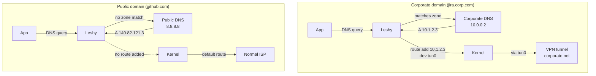

# OpenConnect (Cisco AnyConnect) Split Tunnel with Leshy

This guide shows how to use Leshy with OpenConnect VPN so that **only corporate traffic** goes through the VPN tunnel, while everything else uses your normal internet connection.

## The Problem

By default, OpenConnect takes over your default route -- all traffic goes through the VPN. This means:
- Public internet traffic takes a detour through the corporate network
- Higher latency, lower bandwidth for non-work traffic
- The corporate network sees all your DNS queries

## The Solution



[vpn-slice](https://github.com/dlenski/vpn-slice) configures the tunnel interface without touching the default route. Leshy adds routes dynamically based on DNS queries.

## Setup

### 1. Install OpenConnect and vpn-slice

```bash
# Debian/Ubuntu
sudo apt install openconnect
pip install vpn-slice

# Fedora/RHEL
sudo dnf install openconnect
pip install vpn-slice

# macOS
brew install openconnect
pip install vpn-slice
```

### 2. Create the VPN Connect Script

vpn-slice replaces the default `vpnc-script` -- it configures the tunnel interface (IP, MTU) but **does not add a default route**. We wrap it in a small script that also writes the device name to a file for Leshy.

Save as `/etc/leshy/openconnect-up.sh`:

```bash
#!/bin/bash
#
# vpn-slice wrapper for Leshy.
# Configures the tunnel interface (via vpn-slice) and writes the device
# name so Leshy can route through it.
#

DEVFILE="/run/vpn/corporate.dev"

# Let vpn-slice handle interface configuration (no networks = no routes)
vpn-slice

case "$reason" in
    connect)
        mkdir -p "$(dirname "$DEVFILE")"
        echo "$TUNDEV" > "$DEVFILE"
        ;;
    disconnect)
        rm -f "$DEVFILE"
        ;;
esac
```

```bash
sudo chmod +x /etc/leshy/openconnect-up.sh
sudo mkdir -p /run/vpn
```

### 3. Configure Leshy

`/etc/leshy/config.toml`:

```toml
[server]
listen_address = "127.0.0.53:53"
default_upstream = ["8.8.8.8:53", "8.8.4.4:53"]

[[zones]]
name = "corporate"
dns_servers = ["10.0.0.2:53"]      # corporate DNS, reachable through the tunnel
route_type = "dev"
route_target = "/run/vpn/corporate.dev"
domains = [
    "corp.example.com",
    "jira.corp.example.com",
    "git.corp.example.com",
]
patterns = ["corp"]                 # anything with "corp" in the name
```

Start Leshy:

```bash
sudo leshy service install
# Point DNS at Leshy
echo "nameserver 127.0.0.53" | sudo tee /etc/resolv.conf
```

### 4. Connect the VPN

```bash
sudo openconnect \
    --script /etc/leshy/openconnect-up.sh \
    vpn.corp.example.com
```

For non-interactive use (e.g., systemd service):

```bash
echo "$VPN_PASSWORD" | sudo openconnect \
    --script /etc/leshy/openconnect-up.sh \
    --user="$VPN_USER" \
    --passwd-on-stdin \
    --background \
    --pid-file=/run/vpn/openconnect.pid \
    vpn.corp.example.com
```

### 5. Verify

```bash
# Check the tunnel is up
ip link show | grep tun

# Check Leshy knows the device
cat /run/vpn/corporate.dev
# → tun0

# Resolve a corporate domain -- should get an internal IP
dig @127.0.0.53 jira.corp.example.com

# Check that a route was added through the tunnel
ip route | grep tun0

# Resolve a public domain -- should NOT go through the tunnel
dig @127.0.0.53 github.com
ip route get $(dig +short github.com | head -1)
# → via your normal default gateway, not tun0
```

## Running as a systemd Service

`/etc/systemd/system/openconnect-corp.service`:

```ini
[Unit]
Description=OpenConnect Corporate VPN (split-tunnel via Leshy)
After=network-online.target leshy.service
Wants=network-online.target

[Service]
Type=simple
ExecStart=/usr/sbin/openconnect \
    --script /etc/leshy/openconnect-up.sh \
    --user=%I \
    --passwd-on-stdin \
    vpn.corp.example.com
ExecStopPost=/bin/rm -f /run/vpn/corporate.dev

# Read password from a root-only file
StandardInput=file:/etc/leshy/vpn-password

Restart=on-failure
RestartSec=10

[Install]
WantedBy=multi-user.target
```

```bash
sudo systemctl enable --now openconnect-corp
```

## Static Routes for Non-DNS Resources

Some corporate resources (IP ranges, CIDR blocks) may not be accessed by hostname. Add them as static routes in the zone:

```toml
[[zones]]
name = "corporate"
dns_servers = ["10.0.0.2:53"]
route_type = "dev"
route_target = "/run/vpn/corporate.dev"
domains = ["corp.example.com"]
static_routes = [
    "10.0.0.0/8",       # entire corporate RFC1918 range
    "172.16.0.0/12",     # additional internal range
]
```

These routes are added as soon as the tunnel device appears and removed when it disappears.

## Troubleshooting

**DNS queries for corporate domains return SERVFAIL**
- Check that the corporate DNS server is reachable through the tunnel: `dig @10.0.0.2 jira.corp.example.com` (use the corporate DNS IP directly)
- Make sure the tunnel interface has the VPN-assigned IP: `ip addr show tun0`

**Routes are not being added**
- Check Leshy logs: `journalctl -u leshy -f`
- Verify the device file exists and contains the right device: `cat /run/vpn/corporate.dev`

**All traffic still goes through VPN**
- Verify OpenConnect was started with `--script /etc/leshy/openconnect-up.sh` (not the default vpnc-script)
- Check for leftover default routes: `ip route | grep default`

**VPN reconnects but routes are stale**
- Leshy reads the device file on each query. When OpenConnect reconnects with a new device name, the script overwrites the file and new routes use the new device automatically.
