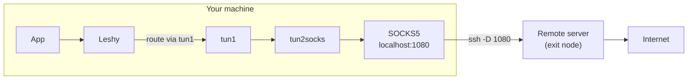
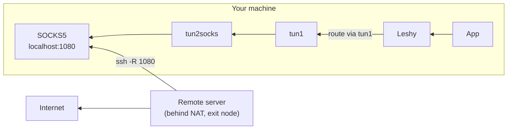

# SSH Tunnel + tun2socks with Leshy

Route specific traffic through an SSH tunnel using tun2socks and Leshy. No full VPN needed -- just SSH access to a remote server.

Two topologies are covered:

| Topology | SSH direction | Use case |
|----------|--------------|----------|
| [Direct](#direct-tunnel) | You → remote server | You can reach the server (cloud VPS, office jumpbox) |
| [Reverse](#reverse-tunnel) | Remote server → you | The server can't be reached directly (behind NAT/firewall) but it can SSH out to you |

Both end up the same way: a SOCKS proxy on your local machine, a tun device via tun2socks, and Leshy routing matched traffic through it.

## Prerequisites

### Install tun2socks

Download from [xjasonlyu/tun2socks](https://github.com/xjasonlyu/tun2socks/releases):

```bash
# Linux (amd64)
curl -L -o /usr/local/bin/tun2socks \
    https://github.com/xjasonlyu/tun2socks/releases/latest/download/tun2socks-linux-amd64
chmod +x /usr/local/bin/tun2socks

# macOS
brew install tun2socks
```

---

## Direct Tunnel

You initiate the SSH connection **outbound** to a remote server. Traffic exits at the remote end.



### 1. Start the SSH SOCKS Proxy

```bash
ssh -D 1080 -N -f -o ServerAliveInterval=30 user@remote-server.com
```

Flags:
- **`-D 1080`** -- local SOCKS5 proxy on localhost:1080
- **`-N`** -- no remote command (just the tunnel)
- **`-f`** -- background after authentication
- **`-o ServerAliveInterval=30`** -- keep the connection alive

Verify:

```bash
curl --socks5-hostname 127.0.0.1:1080 https://ifconfig.me
# → should print the remote server's IP
```

### 2. Create the Tunnel Device

```bash
# Start tun2socks (runs in foreground)
sudo tun2socks -device tun1 -proxy socks5://127.0.0.1:1080

# In another terminal: assign an IP and bring it up
sudo ip addr add 198.18.0.1/15 dev tun1
sudo ip link set dev tun1 up
```

On macOS:

```bash
sudo tun2socks -device utun9 -proxy socks5://127.0.0.1:1080

# In another terminal:
sudo ifconfig utun9 198.18.0.1 198.18.0.1 up
```

> **Note:** 198.18.0.0/15 is reserved for benchmarking (RFC 5737) and won't conflict with real addresses. Any unused private range works.

### 3. Write the Device File and Configure Leshy

```bash
sudo mkdir -p /run/vpn
echo "tun1" | sudo tee /run/vpn/ssh-tunnel.dev
```

`/etc/leshy/config.toml`:

```toml
[server]
listen_address = "127.0.0.53:53"
default_upstream = ["8.8.8.8:53", "8.8.4.4:53"]

[[zones]]
name = "ssh-tunnel"
dns_servers = []                        # use default upstream DNS
route_type = "dev"
route_target = "/run/vpn/ssh-tunnel.dev"
domains = ["example.com", "ifconfig.me"]
patterns = ["openai", "anthropic"]
```

```bash
sudo leshy service install
echo "nameserver 127.0.0.53" | sudo tee /etc/resolv.conf
```

### 4. Verify

```bash
# Traffic should exit from the remote server's IP
curl https://ifconfig.me
# → remote server's IP

# Non-matching domains go direct
curl https://icanhazip.com
# → your real IP
```

### Direct Tunnel Wrapper Script

Save as `/etc/leshy/ssh-tunnel.sh`:

```bash
#!/bin/bash
set -e

REMOTE="user@remote-server.com"
SOCKS_PORT=1080
TUN_DEV="tun1"
TUN_ADDR="198.18.0.1/15"
DEVFILE="/run/vpn/ssh-tunnel.dev"
SSH_PID="/run/vpn/ssh-tunnel.pid"

start() {
    mkdir -p /run/vpn

    # Start SSH SOCKS proxy
    ssh -D "$SOCKS_PORT" -N -f \
        -o ServerAliveInterval=30 \
        -o ExitOnForwardFailure=yes \
        -o StrictHostKeyChecking=accept-new \
        "$REMOTE"
    echo $! > "$SSH_PID"

    # Wait for SOCKS proxy to be ready
    for i in $(seq 1 10); do
        if ss -tln | grep -q ":$SOCKS_PORT "; then break; fi
        sleep 0.5
    done

    # Create tunnel device
    tun2socks -device "$TUN_DEV" -proxy "socks5://127.0.0.1:$SOCKS_PORT" &
    sleep 1

    ip addr add "$TUN_ADDR" dev "$TUN_DEV"
    ip link set dev "$TUN_DEV" up

    echo "$TUN_DEV" > "$DEVFILE"
    echo "Tunnel up: $TUN_DEV via $REMOTE"
}

stop() {
    rm -f "$DEVFILE"
    [ -f "$SSH_PID" ] && kill "$(cat "$SSH_PID")" 2>/dev/null
    rm -f "$SSH_PID"
    pkill -f "tun2socks.*$TUN_DEV" 2>/dev/null || true
    ip link del "$TUN_DEV" 2>/dev/null || true
    echo "Tunnel down"
}

case "${1:-start}" in
    start) start ;;
    stop)  stop  ;;
    restart) stop; start ;;
    *) echo "Usage: $0 {start|stop|restart}"; exit 1 ;;
esac
```

---

## Reverse Tunnel

The remote machine initiates the SSH connection **to you** (or to a shared jump host). Useful when the remote machine is behind NAT, a firewall, or a corporate network that blocks inbound connections.

Traffic still exits at the remote end -- the SSH direction is just flipped.



### How Reverse SOCKS Works

SSH's `-R` flag without a destination creates a SOCKS proxy on the **server** side (your machine) that forwards traffic through the tunnel to exit at the **client** side (the remote machine):

```
ssh -R [bind_address:]port
```

When no explicit destination is given, SSH acts as a SOCKS 4/5 proxy -- connections to `bind_address:port` on the server are forwarded through the tunnel and resolved/connected at the client.

### Use Cases

- **Home server behind NAT** -- your home machine has no public IP, but it can SSH to your VPS. You sit at the VPS and want to route traffic through your home connection.
- **Office machine behind a firewall** -- a machine inside the corporate network SSHs out to your laptop. You route corporate-domain traffic through it to reach internal services.
- **Remote IoT / lab device** -- a device in a restricted network phones home via SSH. You route diagnostics traffic through it.

### 1. On the Remote Machine (Behind NAT)

The remote machine initiates the reverse tunnel to your machine:

```bash
ssh -R 1080 -N -f \
    -o ServerAliveInterval=30 \
    -o ExitOnForwardFailure=yes \
    user@your-machine.com
```

This opens port 1080 **on your machine**. Connections to `your-machine:1080` are forwarded through the SSH tunnel and exit at the remote machine.

> **Note:** By default, `-R` binds to `localhost` only. If your SSH server's `GatewayPorts` is set to `no` (the default), the SOCKS proxy is only reachable from your machine -- which is exactly what we want.

For persistent reverse tunnels, use [autossh](https://www.harding.motd.ca/autossh/) on the remote machine:

```bash
autossh -M 0 -R 1080 -N -f \
    -o ServerAliveInterval=30 \
    -o ServerAliveCountMax=3 \
    -o ExitOnForwardFailure=yes \
    user@your-machine.com
```

### 2. On Your Machine

Once the reverse tunnel is established, the rest is identical to the direct setup -- there's a SOCKS proxy on localhost:1080.

Verify the SOCKS proxy is working:

```bash
curl --socks5-hostname 127.0.0.1:1080 https://ifconfig.me
# → should print the remote machine's public IP (its ISP, not yours)
```

Create the tunnel device:

```bash
sudo tun2socks -device tun1 -proxy socks5://127.0.0.1:1080

# In another terminal:
sudo ip addr add 198.18.0.1/15 dev tun1
sudo ip link set dev tun1 up

sudo mkdir -p /run/vpn
echo "tun1" | sudo tee /run/vpn/ssh-tunnel.dev
```

### 3. Configure Leshy

Same as the direct tunnel. For the office-behind-firewall case, you'd also use the corporate DNS:

```toml
[server]
listen_address = "127.0.0.53:53"
default_upstream = ["8.8.8.8:53", "8.8.4.4:53"]

[[zones]]
name = "office"
dns_servers = ["10.0.0.2:53"]          # corporate DNS, reachable through the tunnel
route_type = "dev"
route_target = "/run/vpn/ssh-tunnel.dev"
domains = ["internal.corp.com", "jira.corp.com"]
patterns = ["corp"]
static_routes = ["10.0.0.0/8"]         # corporate IP ranges
```

### Reverse Tunnel Wrapper Scripts

**On the remote machine** -- `/etc/leshy/reverse-tunnel-client.sh`:

```bash
#!/bin/bash
# Run this on the machine behind NAT.
# It connects to your-machine and opens a reverse SOCKS proxy.

set -e

JUMP_HOST="user@your-machine.com"
SOCKS_PORT=1080

ssh -R "$SOCKS_PORT" -N \
    -o ServerAliveInterval=30 \
    -o ServerAliveCountMax=3 \
    -o ExitOnForwardFailure=yes \
    "$JUMP_HOST"
```

**On your machine** -- `/etc/leshy/reverse-tunnel-server.sh`:

```bash
#!/bin/bash
# Run this on your machine (the SSH server side).
# Waits for the reverse SOCKS proxy to appear, then creates the tun device.

set -e

SOCKS_PORT=1080
TUN_DEV="tun1"
TUN_ADDR="198.18.0.1/15"
DEVFILE="/run/vpn/ssh-tunnel.dev"

start() {
    mkdir -p /run/vpn

    # Wait for the remote machine to establish the reverse tunnel
    echo "Waiting for reverse SOCKS proxy on port $SOCKS_PORT..."
    for i in $(seq 1 60); do
        if ss -tln | grep -q ":$SOCKS_PORT "; then break; fi
        sleep 1
    done

    if ! ss -tln | grep -q ":$SOCKS_PORT "; then
        echo "Timed out waiting for reverse tunnel"
        exit 1
    fi

    tun2socks -device "$TUN_DEV" -proxy "socks5://127.0.0.1:$SOCKS_PORT" &
    sleep 1

    ip addr add "$TUN_ADDR" dev "$TUN_DEV"
    ip link set dev "$TUN_DEV" up

    echo "$TUN_DEV" > "$DEVFILE"
    echo "Tunnel up: $TUN_DEV via reverse SSH"
}

stop() {
    rm -f "$DEVFILE"
    pkill -f "tun2socks.*$TUN_DEV" 2>/dev/null || true
    ip link del "$TUN_DEV" 2>/dev/null || true
    echo "Tunnel down"
}

case "${1:-start}" in
    start) start ;;
    stop)  stop  ;;
    restart) stop; start ;;
    *) echo "Usage: $0 {start|stop|restart}"; exit 1 ;;
esac
```

---

## Avoiding Routing Loops

Traffic to the SSH server itself **must not** go through the tunnel -- that would create a loop. This applies to both topologies.

For **direct tunnels**, the SSH server is a remote host you connect to. If its domain matches a Leshy zone, exclude it:

```toml
[[zones]]
name = "ssh-tunnel"
mode = "exclusive"                      # route everything EXCEPT:
dns_servers = []
route_type = "dev"
route_target = "/run/vpn/ssh-tunnel.dev"
domains = ["remote-server.com"]         # exclude the SSH server
patterns = ['\.local$']                 # exclude local domains
```

Or pin its route through your real gateway before starting tun2socks:

```bash
sudo ip route add <ssh-server-ip>/32 via <your-default-gateway>
```

For **reverse tunnels**, the SSH connection is inbound, so there's no loop risk on your side. The remote machine needs to make sure its SSH connection to you doesn't get routed back through itself -- but since it's the one initiating the connection through its own default route, this is handled naturally.

## Running as systemd Services

### Direct tunnel

`/etc/systemd/system/ssh-tunnel.service`:

```ini
[Unit]
Description=SSH tunnel via tun2socks (split-route via Leshy)
After=network-online.target leshy.service
Wants=network-online.target

[Service]
Type=simple
ExecStart=/etc/leshy/ssh-tunnel.sh start
ExecStop=/etc/leshy/ssh-tunnel.sh stop
Restart=on-failure
RestartSec=10

[Install]
WantedBy=multi-user.target
```

### Reverse tunnel (remote side)

`/etc/systemd/system/reverse-tunnel-client.service` on the remote machine:

```ini
[Unit]
Description=Reverse SSH SOCKS tunnel to jump host
After=network-online.target
Wants=network-online.target

[Service]
Type=simple
ExecStart=/etc/leshy/reverse-tunnel-client.sh
Restart=always
RestartSec=10

[Install]
WantedBy=multi-user.target
```

### Reverse tunnel (your side)

`/etc/systemd/system/reverse-tunnel-server.service` on your machine:

```ini
[Unit]
Description=tun2socks for reverse SSH tunnel (split-route via Leshy)
After=network-online.target leshy.service
Wants=network-online.target

[Service]
Type=simple
ExecStart=/etc/leshy/reverse-tunnel-server.sh start
ExecStop=/etc/leshy/reverse-tunnel-server.sh stop
Restart=on-failure
RestartSec=10

[Install]
WantedBy=multi-user.target
```

## Troubleshooting

**`curl` hangs for routed domains**
- Verify the SOCKS proxy works: `curl --socks5-hostname 127.0.0.1:1080 https://ifconfig.me`
- Check that the tun device is up: `ip link show tun1`
- Check tun2socks logs for errors

**Traffic loops (connection timeout to SSH server)**
- The SSH server's traffic is going through the tunnel. Pin its route through your real gateway:
  ```bash
  sudo ip route add <ssh-server-ip>/32 via <your-real-gateway>
  ```

**Reverse tunnel port not open**
- Check that the remote machine's SSH connection is alive: `ss -tln | grep 1080`
- Verify `GatewayPorts` in `/etc/ssh/sshd_config` is not set to `clientspecified` (default `no` is fine for localhost binding)
- If using autossh, check its logs: `journalctl -u reverse-tunnel-client`

**DNS works but traffic doesn't flow**
- Verify tun1 has an IP: `ip addr show tun1`
- Check that routes exist: `ip route | grep tun1`
- Make sure tun2socks is running: `pgrep tun2socks`

**Device file is stale after SSH disconnect**
- The wrapper scripts handle cleanup on stop. For systemd services, `Restart=on-failure` recreates everything. Leshy handles missing devices gracefully -- DNS responses are still returned, routes are just skipped.
